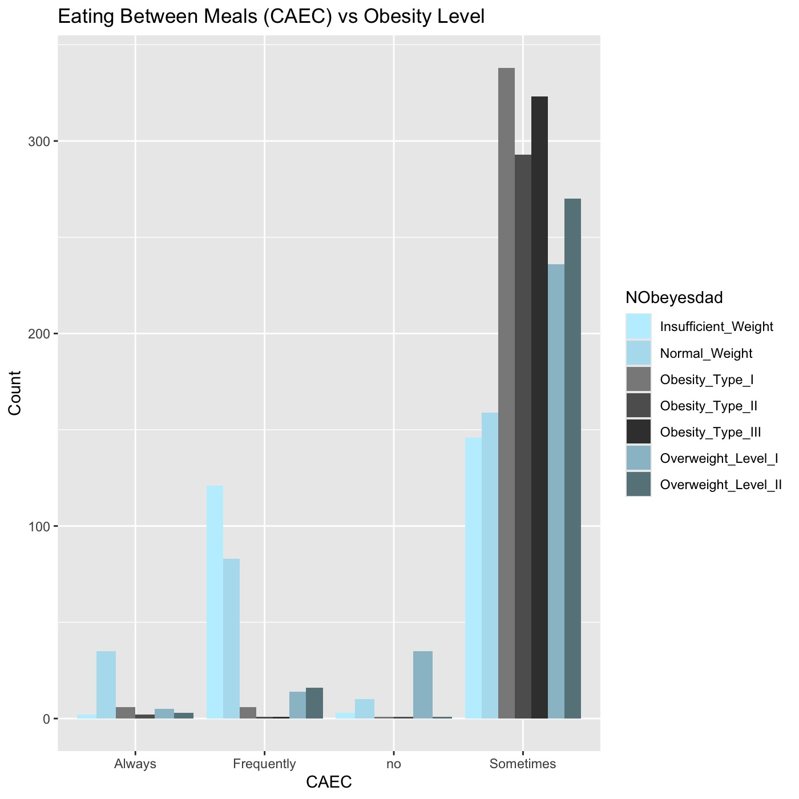
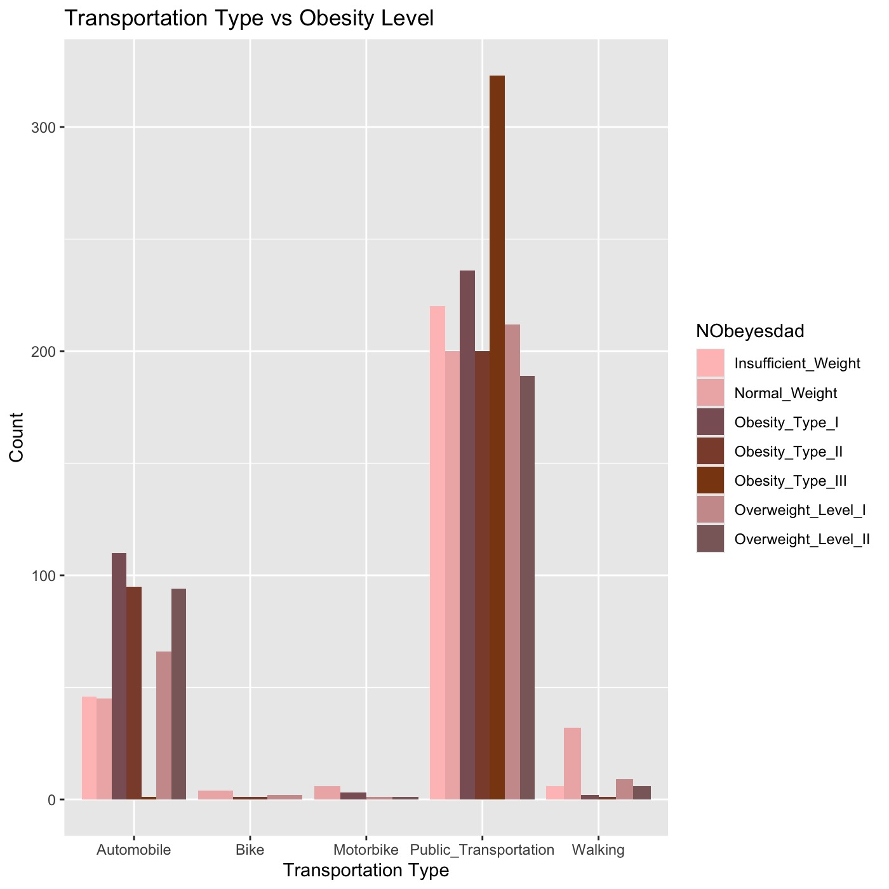
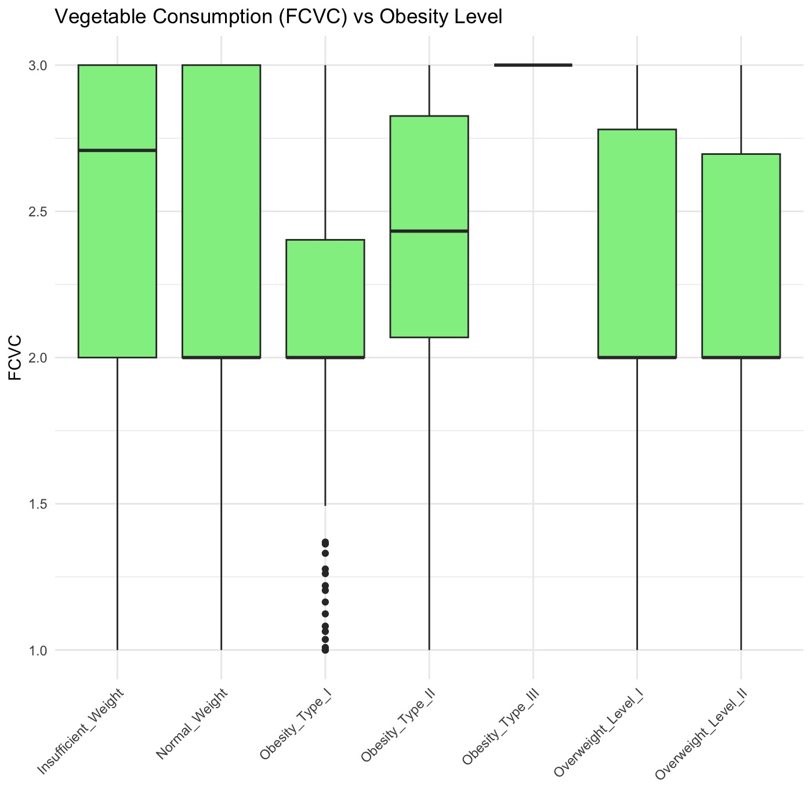
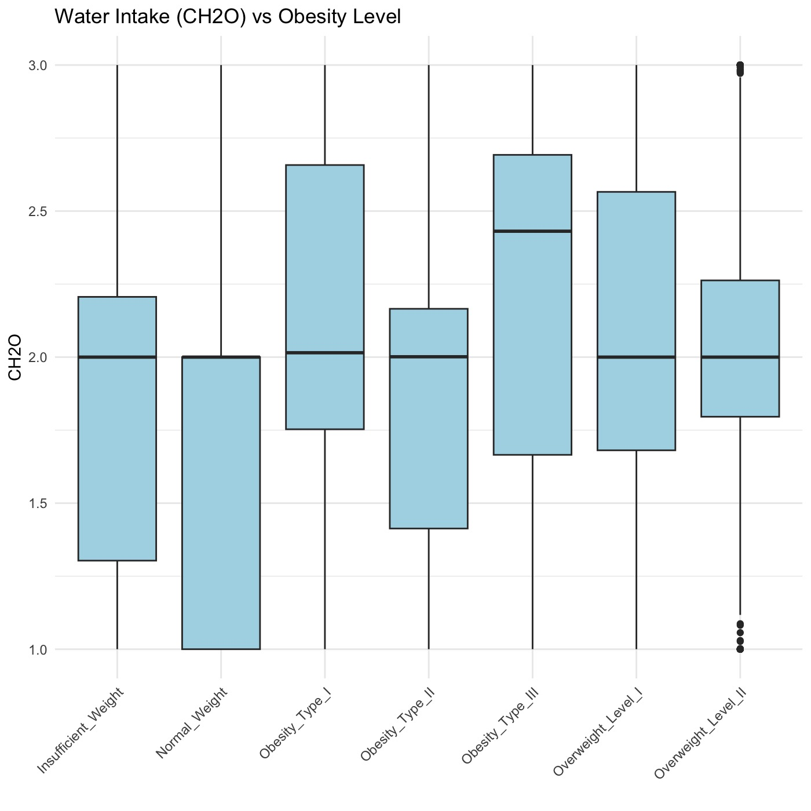
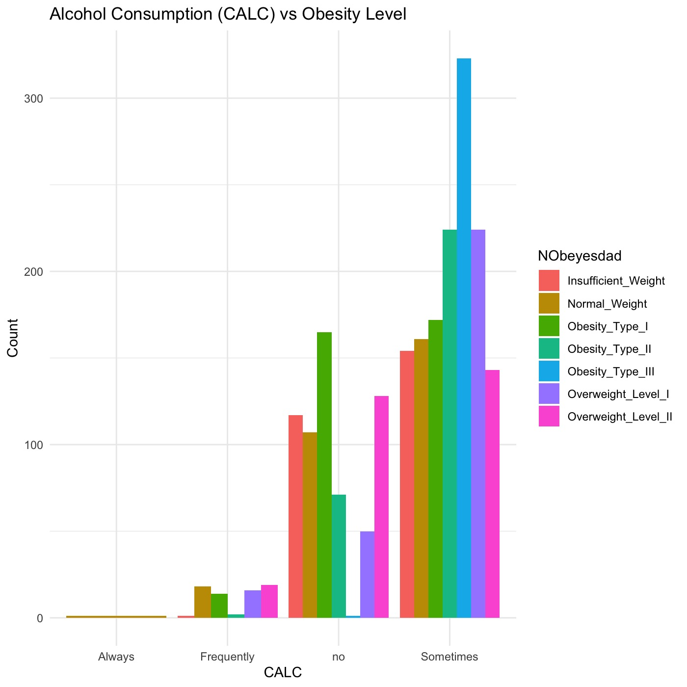

# Obesity Levels and Indicators 

## Dataset Information and Source

This dataset include data for the estimation of obesity levels in individuals from the countries of Mexico, Peru and Colombia, based on their eating habits and physical condition. The data contains 17 attributes and 2111 records, the records are labeled with the class variable NObesity (Obesity Level), that allows classification of the data using the values of Insufficient Weight, Normal Weight, Overweight Level I, Overweight Level II, Obesity Type I, Obesity Type II and Obesity Type III. 77% of the data was generated synthetically using the Weka tool and the SMOTE filter, 23% of the data was collected directly from users through a web platform.

FAVC : Feature, Binary, " Do you eat high caloric food frequently? "
FCVC : Feature, Integer, " Do you usually eat vegetables in your meals? "
NCP : Feature, Continuous, " How many main meals do you have daily? "
CAEC : Feature, Categorical, " Do you eat any food between meals? "
SMOKE : Feature, Binary, " Do you smoke? "
CH2O: Feature, Continuous, " How much water do you drink daily? "
SCC: Feature, Binary, " Do you monitor the calories you eat daily? "
FAF: Feature, Continuous, " How often do you have physical activity? "
TUE : Feature, Integer, " How much time do you use technological devices such as cell phone, videogames, television, computer and others? "

CALC : Feature, Categorical, " How often do you drink alcohol? "
MTRANS : Feature, Categorical, " Which transportation do you usually use? "
NObeyesdad : Target, Categorical, "Obesity level" " [SOURCE](https://www.kaggle.com/datasets/fatemehmehrparvar/obesity-levels)

## Data Cleaning and Preparation
---
In the following code, we begin by installing the necessary packages needed to run our functions as well as clean the data, ensuring standardized column names and proper arrangement of the data by age. 
----
---
#installing and loading necessary packages

install.packages("dplyr")
install.packages("tidyverse")

library(dplyr)  
library(tidyverse)

install.packages("skimr")  
library(skimr)

install.packages("janitor")  
library(janitor)

install.packages("here")  
library(here)

#importing dataset  
obesity_data <- read.csv(file.choose())

#getting a glimpse of the data  
glimpse(obesity_data)

#Standardize column names: ensures that only characters, numbers and underscores in the names  
clean_names(obesity_data)

#sort the data by age  
obesity_data %>% arrange(Age)

--- 
Data Visualization 
---
---
install.packages("ggplot2")  
library(ggplot2)

#2. Eating Between Meals (CAEC) vs Obesity Level  

ggplot(obesity_data, aes(x = CAEC, fill = NObeyesdad)) +  
  geom_bar(position = "dodge") + scale_fill_manual(values = c(  
    "Insufficient_Weight" = "lightblue1",  
    "Normal_Weight" = "lightblue2",  
    "Overweight_Level_I" = "lightblue3",  
    "Overweight_Level_II" = "lightblue4",  
    "Obesity_Type_I" = "gray54",  
    "Obesity_Type_II" = "gray37",  
    "Obesity_Type_III" = "gray24"  
  )) +   
  labs(title = "Eating Between Meals (CAEC) vs Obesity Level", x = "CAEC", y = "Count")  

   

#2. Transportation Type (MTRANS) vs Obesity Level  
ggplot(obesity_data, aes(x = MTRANS, fill = NObeyesdad)) +  
  geom_bar(position = "dodge") + scale_fill_manual(values = c(  
    "Insufficient_Weight" = "rosybrown1",  
    "Normal_Weight" = "rosybrown2",  
    "Overweight_Level_I" = "rosybrown3",  
    "Overweight_Level_II" = "rosybrown4",  
    "Obesity_Type_I" = "lightpink4",  
    "Obesity_Type_II" = "salmon4",  
    "Obesity_Type_III" = "saddlebrown"  
  )) +  
  labs(title = "Transportation Type vs Obesity Level", x = "Transportation Type", y = "Count")  
  
    

#3. Vegetable Consumption (FCVC) vs Obesity Level  
ggplot(obesity_data, aes(x = NObeyesdad, y = FCVC)) +  
  geom_boxplot(fill = "lightgreen") +  
  theme_minimal() +  
  theme(axis.text.x = element_text(angle = 45, hjust = 1)) +  
  labs(title = "Vegetable Consumption (FCVC) vs Obesity Level", x = "", y = "FCVC")  

    

#4. Water Intake (CH2O) vs Obesity Level  
ggplot(obesity_data, aes(x = NObeyesdad, y = CH2O)) +  
  geom_boxplot(fill = "lightblue") +  
  theme_minimal() +  
  theme(axis.text.x = element_text(angle = 45, hjust = 1)) +  
  labs(title = "Water Intake (CH2O) vs Obesity Level", x = "", y = "CH2O")  

    

#5. Alcohol Consumption (CALC) vs Obesity Level  
ggplot(obesity_data, aes(x = CALC, fill = NObeyesdad)) +  
  geom_bar(position = "dodge") +  
  theme_minimal() +  
  labs(title = "Alcohol Consumption (CALC) vs Obesity Level", x = "CALC", y = "Count")  

    
  
---

